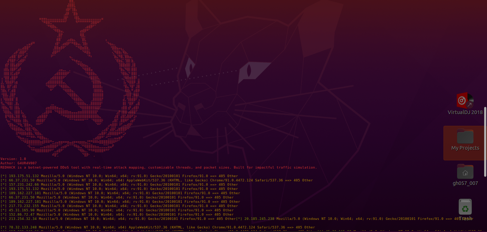

# REDHACK



**REDHACK** is a robust DDoS (Distributed Denial of Service) tool designed for network stress testing and research purposes. This tool allows users to download and deploy a botnet for executing DDoS attacks. It is intended for cybersecurity professionals and ethical hackers for legitimate testing purposes only.

## Features

- **Botnet Download**: Download botnets from Shodan and save them as a JSON file for use.
- **Traffic Simulation**: Simulate traffic on a target URL.
- **Customizable Requests**: Control the number of requests, packet size, and use of proxies.
- **Multi-threading Support**: Configure the number of threads for performance optimization.
- **User-Friendly CLI**: Simple command-line interface for ease of use.

## Installation

To install **REDHACK**, follow these steps:

1. Clone the repository:
   ```bash
   git clone https://github.com/0xgh057r3c0n/REDHACK.git
   ```
2. Navigate to the project directory:
   ```bash
   cd REDHACK
   ```
3. Install the required dependencies:
   ```bash
   pip install -r requirements.txt
   ```

## Usage

To use **REDHACK**, you can run the script from the command line. Here’s how to execute the main functionalities:

### Botnet Traffic Simulator

The main command for simulating botnet traffic is:

```bash
python3 red.py [OPTIONS]
```

#### Optional Arguments:

- `-h, --help`: Show help message and exit.
- `-t TARGET, --target TARGET`: Target URL to simulate traffic on.
- `-n NUM_REQUESTS, --num_requests NUM_REQUESTS`: Number of requests to simulate (default: 100).
- `-p PROXY, --proxy PROXY`: Proxy server to route requests through (optional).
- `-j NUM_THREADS, --num_threads NUM_THREADS`: Number of threads to use (default: 1).
- `-s PACKET_SIZE, --packet_size PACKET_SIZE`: Size of packets to send (default: 1024).
- `--download-botnet`: Download botnets from Shodan and save to JSON file.

### Example Usage

1. To download botnets from Shodan:
   ```bash
   python3 red.py --download-botnet
   ```

2. To simulate traffic on a target:
   ```bash
   python3 red.py -t http://example.com -n 200 -j 5
   ```

This command simulates 200 requests to `http://example.com` using 5 threads.

## Example Output
The following is an example of the tool's output during a simulated attack:

```

⠀
⠀⠀⠀⠀⠀⠀⠀⠀⠀⠀⠀⠀⠀⠀⠀⠀⠀⠀⠀⠀⠀⠀⠀⠀⠀⠀⠀⠀⠀⠀⠀⠀⢰⡆⠀⠀⠀⠀⠀⠀⠀⠀⠀⠀⠀⠀⠀⠀⠀⠀⠀⠀⠀⠀⠀⠀⠀⠀⠀⠀⠀⠀⠀⠀⠀
⠀⠀⠀⠀⠀⠀⠀⠀⠀⠀⠀⠀⠀⠀⠀⠀⠀⠀⠀⠀⠀⠀⠀⠀⠀⠀⠀⠀⠀⠀⠀⠀⣿⣿⡀⠀⠀⠀⠀⠀⠀⠀⠀⠀⠀⠀⠀⠀⠀⠀⠀⠀⠀⠀⠀⠀⠀⠀⠀⠀⠀⠀⠀⠀⠀
⠀⠀⠀⠀⠀⠀⠀⠀⠀⠀⠀⠀⠀⠀⠀⠀⠀⠀⠀⠀⠀⠀⠀⠀⠀⠀⠀⠀⠀⠀⠀⣼⣿⣿⣇⠀⠀⠀⠀⠀⠀⠀⠀⠀⠀⠀⠀⠀⠀⠀⠀⠀⠀⠀⠀⠀⠀⠀⠀⠀⠀⠀⠀⠀⠀
⠀⠀⠀⠀⠀⠀⠀⠀⠀⠀⠀⠀⠀⠀⠀⠀⠀⠀⠀⠀⠀⠀⠀⠀⠀⠀⠀⠀⠀⠀⢰⣿⠏⢹⣿⡄⠀⠀⠀⠀⠀⠀⠀⠀⠀⠀⠀⠀⠀⠀⠀⠀⠀⠀⠀⠀⠀⠀⠀⠀⠀⠀⠀⠀⠀
⠀⠀⠀⠀⠀⠀⠀⠀⠀⠀⠀⠀⠀⠀⠀⠀⠀⠀⠀⠀⠀⠀⠀⠀⠀⠀⠀⠀⠀⢀⣼⡿⠀⠈⣿⣷⠀⠀⠀⠀⠀⠀⠀⠀⠀⠀⠀⠀⠀⠀⠀⠀⠀⠀⠀⠀⠀⠀⠀⠀⠀⠀⠀⠀⠀
⠀⠀⠀⠀⠀⠀⠀⠀⠀⠀⠀⠀⠀⠀⠀⠀⠀⠀⣤⣤⣤⣄⣀⣀⣀⣀⣀⣀⣀⣸⣿⠃⠀⠀⠸⣿⣧⣀⣀⣀⣀⣀⣀⣀⣀⣀⣀⣤⠀⠀⠀⠀⠀⠀⠀⠀⠀⠀⠀⠀⠀⠀⠀⠀⠀
⠀⠀⠀⠀⠀⠀⠀⠀⠀⠀⠀⠀⠀⠀⠀⠀⠀⠀⠀⠙⠿⣿⣿⣛⠛⠛⠛⠛⠛⠛⠋⠀⠀⠀⠀⠻⠛⠛⠛⠛⠛⠛⣻⣿⣿⠿⠋⠀⠀⠀⠀⠀⠀⠀⠀⠀⠀⠀⠀⠀⠀⠀⠀⠀⠀
⠀⠀⠀⠀⠀⠀⠀⠀⠀⠀⠀⠀⠀⠀⠀⠀⠀⠀⠀⠀⠀⠈⠛⢿⣿⣦⡀⠀⠀⠀⠀⠀⠀⠀⠀⠀⠀⠀⠀⢀⣴⣾⡿⠋⠁⠀⠀⠀⠀⠀⠀⠀⠀⠀⠀⠀⠀⠀⠀⠀⠀⠀⠀⠀⠀
⠀⠀⠀⠀⠀⠀⠀⠀⠀⠀⠀⠀⠀⠀⠀⠀⠀⠀⠀⠀⠀⠀⠀⠀⠈⠻⢿⣷⣤⡀⠀⠀⠀⠀⠀⠀⠀⣴⣾⡿⠛⠁⠀⠀⠀⠀⠀⠀⠀⠀⠀⠀⠀⠀⠀⠀⠀⠀⠀⠀⠀⠀⠀⠀⠀
⠀⠀⠀⠀⠀⠀⠀⠀⠀⠀⠀⠀⠀⠀⠀⠀⠀⠀⠀⠀⠀⠀⠀⠀⠀⠀⢀⣿⡟⠀⠀⠀⠀⠀⠀⠀⠀⢿⣿⡀⠀⠀⠀⠀⠀⠀⠀⠀⠀⠀⠀⠀⠀⠀⠀⠀⠀⠀⠀⠀⠀⠀⠀⠀⠀
⠀⠀⠀⠀⠀⠀⠀⠀⠀⠀⠀⠀⠀⠀⠀⠀⠀⠀⠀⠀⠀⠀⠀⠀⠀⠀⣾⣿⠁⠀⠀⣠⣴⣦⣄⠀⠀⠈⣿⣇⠀⠀⠀⠀⠀⠀⠀⠀⠀⡄⠀⠀⠀⠀⠀⠀⠀⠀⠀⠀⠀⠀⠀⠀⠀
⠀⠀⠀⠀⠀⠀⠀⠀⠀⠀⠀⠀⣀⣤⡾⠛⠀⠀⠀⠀⠀⠀⠀⠀⠀⢰⣿⠃⢀⣴⣾⡿⠋⠛⢿⣷⣤⡀⢹⣿⡆⠀⠀⠀⠀⠀⠀⠀⠀⠈⠳⣦⣄⡀⠀⠀⠀⠀⠀⠀⠀⠀⠀⠀⠀
⠀⠀⠀⠀⠀⠀⠀⠀⣀⣀⣴⣿⣿⠋⠀⠀⠀⠀⠀⠀⠀⠀⠀⠀⢀⣿⣿⣶⡿⠟⠁⠀⠀⠀⠀⠉⠻⣿⣶⣿⣷⡀⠀⠀⠀⠀⠀⠀⠀⠀⠀⠘⣿⣿⣦⡤⣄⡀⠀⠀⠀⠀⠀⠀⠀
⠀⠀⠀⠀⠀⠀⣠⡾⢩⣿⣿⠟⡁⠀⠀⠀⠀⠀⠀⠀⠀⠀⠀⠀⣼⣿⠟⠋⠀⠀⠀⠀⠀⠀⠀⠀⠀⠀⠙⠿⣿⣧⠀⠀⠀⠀⠀⠀⠀⠀⠀⠀⢌⠻⣿⣷⡌⢿⣦⡀⠀⠀⠀⠀⠀
⠀⠀⠀⠀⣠⣾⣿⠁⣿⠟⢉⣴⠃⠀⠀⠀⠀⠀⠀⠀⠀⠀⠀⠸⠋⠁⠀⠀⠀⠀⠀⠀⢤⡀⠀⠀⠀⠀⠀⠀⠈⠛⠆⠀⠀⠀⠀⠀⠀⠀⠀⠀⠈⣷⣌⠻⣿⡈⣿⣷⣤⡀⠀⠀⠀
⠀⠀⠀⣼⢻⣿⡟⠐⣡⣾⡿⠃⠀⠀⠀⠀⠀⠀⠀⠀⠀⠀⠀⠀⠀⠀⠀⠀⠀⠀⠀⠀⠀⠙⠳⣶⣤⣀⠀⠀⠀⠀⠀⠀⠀⠀⠀⠀⠀⠀⠀⠀⠀⠈⢿⣷⣮⡁⢹⣿⡇⣷⡀⠀⠀
⠀⠀⣾⡟⢸⣿⣧⣾⡿⠋⠀⠀⠀⠀⠀⠀⠀⠀⠀⠀⠀⠀⠀⠀⠀⠀⠀⠀⠀⠀⠀⠀⠀⠀⠀⠈⠛⢿⣷⣦⣄⠀⠀⠀⠀⠀⠀⠀⠀⠀⠀⠀⠀⠀⠀⢹⣿⣿⣾⣿⡇⣸⣿⠀⠀
⠀⢰⣿⣧⢸⣿⡿⢋⣴⠇⠀⠀⠀⠀⠀⠀⠀⠀⠀⠀⠀⠀⠀⠀⠀⠀⠀⣠⣤⣀⡀⠀⡀⠀⠀⠀⠀⠀⠙⢿⣿⣿⣤⠀⠀⠀⠀⠀⠀⠀⠀⠀⠀⠀⠀⠘⣷⣌⠻⣿⡇⣿⣿⡇⠀
⠀⢸⣿⣿⢸⣏⣴⣿⠟⠀⠀⠀⠀⠀⠀⠀⠀⠀⠀⠀⠀⠀⠀⠀⠀⣠⣾⣿⣿⣿⣿⠟⠁⠀⠀⠀⠀⠀⠀⠈⠻⣿⣿⣷⣄⠀⠀⠀⠀⠀⠀⠀⠀⠀⠀⠀⠹⣿⣷⣌⠃⣿⣿⡇⠀
⢠⠘⣿⣿⢠⣿⣿⠟⠀⠀⠀⠀⠀⠀⠀⠀⠀⠀⠀⠀⠀⠀⠀⣠⣾⣿⣿⣿⣿⠟⠁⠀⠀⠀⠀⠀⠀⠀⠀⠀⠀⠘⣿⣿⣿⣧⡀⠀⠀⠀⠀⠀⠀⠀⠀⠀⠀⣘⢿⣿⣦⣿⣿⠇⣀
⣸⡀⢻⣿⣾⡿⢣⣶⠀⠀⠀⠀⠀⠀⠀⠀⠀⠀⠀⠀⠀⣠⣾⣿⣿⣿⣿⣿⣿⣤⡀⠀⠀⠀⠀⠀⠀⠀⠀⠀⠀⠀⠘⣿⣿⣿⣧⠀⠀⠀⠀⠀⠀⠀⠀⠀⠀⢸⡌⠻⣿⣿⡿⢀⣿
⣿⣧⠀⣿⡟⢡⣾⡇⠀⠀⠀⠀⠀⠀⠀⠀⠀⠀⠀⠀⠀⠙⢿⣿⣿⠟⠁⠙⢿⣿⣿⣦⡀⠀⠀⠀⠀⠀⠀⠀⠀⠀⠀⣿⣿⣿⣿⡄⠀⠀⠀⠀⠀⠀⠀⠀⠀⠘⣿⣄⠹⣿⠃⣸⣿
⢹⣿⣆⠸⢁⣾⣿⠀⠀⠀⠀⠀⠀⠀⠀⠀⠀⠀⠀⠀⠀⠀⠀⠛⠁⠀⠀⠀⠀⠙⢿⣿⣿⣦⡀⠀⠀⠀⠀⠀⠀⠀⠀⢸⣿⣿⣿⣧⠀⠀⠀⠀⠀⠀⠀⠀⠀⠀⢿⣿⣆⠛⣰⣿⡿
⠘⣿⣿⡄⣸⣿⡟⠀⠀⠀⠀⠀⠀⠀⠀⠀⠀⠀⠀⠀⠀⠀⠀⠀⠀⠀⠀⠀⠀⠀⠀⠙⢿⣿⣿⣦⡀⠀⠀⠀⠀⠀⠀⣿⣿⣿⣿⣿⠀⠀⠀⠀⠀⠀⠀⠀⠀⢠⠼⣿⣿⢀⣿⣿⠇
⡆⠹⣿⣷⣿⣿⠁⣿⠀⠀⠀⠀⠀⠀⠀⠀⠀⠀⠀⠀⠀⠀⠀⠀⠀⠀⠀⠀⠀⠀⠀⠀⠀⠙⢿⣿⣿⣦⡀⠀⠀⠀⢀⣿⣿⣿⣿⡟⠀⠀⠀⠀⠀⠀⠀⠀⠀⣼⡀⢻⣿⣾⣿⠏⢠
⢻⣄⠙⢿⣿⡇⢀⣿⡄⠀⠀⠀⠀⠀⠀⠀⠀⠀⠀⠀⠀⠀⠀⢀⣀⠀⠀⠀⠀⠀⠀⠀⠀⠀⠈⠹⣿⣿⣿⣦⣀⢀⣿⣿⣿⣿⣿⠃⠀⠀⠀⠀⠀⠀⠀⠀⠀⣿⡇⠘⣿⡿⠁⣠⣿
⠸⣿⣷⣄⢻⡇⢸⣿⣧⠀⠀⠀⠀⠀⠀⠀⠀⠀⠀⠀⠀⣴⣶⣿⣿⣿⣶⣤⣄⡀⠀⠀⠀⠀⠀⠀⠈⠻⣿⣿⣿⣿⣿⣿⣿⣿⠏⠀⠀⠀⠀⠀⠀⠀⠀⠀⢰⣿⣿⢰⡟⣠⣾⣿⠇
⠀⠹⣿⣿⣦⡀⢸⣿⣿⢸⣄⠀⠀⠀⠀⠀⠀⠀⠀⢀⣠⣿⡿⠿⠀⠙⠻⣿⣿⣿⣿⣷⣶⣤⣤⣤⣶⣶⣿⣿⣿⣿⣿⣿⣿⠃⠀⠀⠀⠀⠀⠀⠀⠀⣠⡟⢸⣿⣿⢠⣾⣿⣿⠋⠀
⠀⠀⣿⠻⣿⣿⣌⣿⣿⠀⢿⣧⠀⠀⠀⠀⠀⣠⣶⣿⣿⡟⠀⠀⠀⠀⠀⠀⠉⠛⠿⣿⣿⣿⣿⣿⣿⣿⣿⣿⣿⣿⣿⣿⣿⣷⣄⠀⠀⠀⠀⠀⠀⣰⣿⠁⣼⣿⣣⣿⣿⠟⣱⠆⠀
⠀⠀⠘⣦⡌⠙⢿⣿⣿⡆⢸⣿⣆⠀⠀⠀⢰⣿⣿⣿⠏⠀⠀⠀⠀⠀⠀⠀⠀⠀⠀⠀⠉⠉⠙⠛⠛⠛⠛⠉⠉⠀⠈⠻⣿⣿⣿⡗⠀⠀⠀⠀⣠⣿⡏⢀⣿⣿⠿⠋⢠⣶⠏⠀⠀
⠀⠀⠀⠘⣿⣷⣤⣈⠛⢷⡈⣿⣿⡶⣄⠀⠘⠛⠋⠁⠀⠀⠀⠀⠀⠀⠀⠀⠀⠀⠀⠀⠀⠀⠀⠀⠀⠀⠀⠀⠀⠀⠀⠀⠈⠛⠋⠀⠀⠀⣠⢶⣿⣿⠇⠸⢋⣠⣤⣾⡿⠃⠀⠀⠀
⠀⠀⠀⠀⠈⠻⢿⣿⣿⣶⣄⡸⣿⣿⡘⢿⣦⡀⠀⠀⠀⠀⠀⠀⠀⠀⠀⠀⠀⠀⠀⠀⠀⠀⠀⠀⠀⠀⠀⠀⠀⠀⠀⠀⠀⠀⠀⢀⣠⣾⠃⣼⣿⢏⣠⣶⣿⣿⡿⠛⠁⠀⠀⠀⠀
⠀⠀⠀⠀⠀⠀⠀⢽⠻⢿⣿⣿⣾⣿⣧⡈⢿⣿⣦⡀⠀⠀⠀⠀⠀⠀⠀⠀⠀⠀⠀⠀⠀⠀⠀⠀⠀⠀⠀⠀⠀⠀⠀⠀⠀⢀⣤⣿⡿⢃⣼⣿⣿⣿⣿⠿⠛⣩⠆⠀⠀⠀⠀⠀⠀
⠀⠀⠀⠀⠀⠀⠀⠈⠻⣦⣤⣀⣉⠉⠛⠛⠂⠛⢿⣿⣦⣄⡀⠀⠀⠀⠀⠀⠀⠀⠀⠀⠀⠀⠀⠀⠀⠀⠀⠀⠀⠀⠀⣀⣴⣿⡿⠛⠁⠚⣉⣁⣀⣤⣤⣶⠟⠁⠀⠀⠀⠀⠀⠀⠀
⠀⠀⠀⠀⠀⠀⠀⠀⠀⠈⠙⠿⣿⣿⣿⣿⣿⣿⣷⣾⡿⠿⠿⠛⣒⣠⣤⣶⣶⠶⠶⣶⣤⣴⡶⠶⢶⣶⣶⣦⣜⣛⠛⠿⠿⠷⣿⣿⣿⣿⣿⣿⡿⠟⠋⠁⠀⠀⠀⠀⠀⠀⠀⠀⠀
⠀⠀⠀⠀⠀⠀⠀⠀⠀⠀⠀⠀⠐⢯⣉⣉⠉⠉⢉⣁⣤⣴⣶⣿⣿⣿⠟⠉⣡⣴⡾⠛⠉⠉⠻⢷⣦⣈⠛⢿⣿⣿⣿⣶⣦⣤⣀⣀⣉⣉⣥⣤⠟⠀⠀⠀⠀⠀⠀⠀⠀⠀⠀⠀⠀
⠀⠀⠀⠀⠀⠀⠀⠀⠀⠀⠀⠀⠀⠀⠙⠛⢿⣿⣿⣿⣿⣿⡿⠟⠋⣀⣴⣿⠟⠁⠀⠀⠀⠀⠀⠀⠙⢿⣷⣄⡈⠛⠻⠿⣿⣿⣿⣿⠿⠛⠋⠀⠀⠀⠀⠀⠀⠀⠀⠀⠀⠀⠀⠀⠀
⠀⠀⠀⠀⠀⠀⠀⠀⠀⠀⠀⠀⠀⠀⠀⠀⠀⠀⠀⠀⠀⠀⠀⠀⠾⣿⢋⠀⠀⠀⠀⠀⠀⠀⠀⠀⠀⠀⠙⣿⡿⠂⠀⢀⠀⠀⠀⠀⠀⠀⠀⠀⠀⠀⠀⠀⠀⠀⠀⠀⠀⠀⠀⠀⠀
Version: 1.0
Author: G4UR4V007
REDHACK is a botnet-powered DDoS tool with real-time attack mapping, customizable threads, and packet sizes. Built for impactful traffic simulation.

[*] 213.39.234.134 Mozilla/5.0 (Windows NT 10.0; Win64; x64; rv:91.0) Gecko/20100101 Firefox/91.0 ==> 405 Other
[*] 206.169.119.138 Mozilla/5.0 (Windows NT 10.0; Win64; x64; rv:91.0) Gecko/20100101 Firefox/91.0 ==> 405 Other
[*] 193.175.51.132 Mozilla/5.0 (Windows NT 10.0; Win64; x64) AppleWebKit/537.36 (KHTML, like Gecko) Chrome/91.0.4472.124 Safari/537.36 ==> 405 Other
[*] 75.112.95.85 Mozilla/5.0 (Windows NT 10.0; Win64; x64) AppleWebKit/537.36 (KHTML, like Gecko) Chrome/91.0.4472.124 Safari/537.36 ==> 405 Other
[*] 122.186.99.74 Mozilla/5.0 (Windows NT 10.0; Win64; x64; rv:91.0) Gecko/20100101 Firefox/91.0 ==> 405 Other
[*] 2.207.159.242 Mozilla/5.0 (Windows NT 10.0; Win64; x64) AppleWebKit/537.36 (KHTML, like Gecko) Chrome/91.0.4472.124 Safari/537.36 ==> 405 Other
[*] 208.65.99.3 Mozilla/5.0 (Windows NT 10.0; Win64; x64; rv:91.0) Gecko/20100101 Firefox/91.0 ==> 405 Other
[*] 193.175.51.132 Mozilla/5.0 (Windows NT 10.0; Win64; x64) AppleWebKit/537.36 (KHTML, like Gecko) Chrome/91.0.4472.124 Safari/537.36 ==> 405 Other
[*] 173.14.62.117 Mozilla/5.0 (Windows NT 10.0; Win64; x64; rv:91.0) Gecko/20100101 Firefox/91.0 ==> 405 Other
[*] 91.235.111.155 Mozilla/5.0 (Windows NT 10.0; Win64; x64; rv:91.0) Gecko/20100101 Firefox/91.0 ==> 405 Other
...
```

## Warnings
- **Ethical Use Only**: REDHACK should only be used for testing purposes on networks you own or have explicit permission to test.
- **Legal Compliance**: Ensure compliance with local laws and regulations regarding DDoS attacks and network testing.


## License

This project is licensed under the MIT License. See the [LICENSE](LICENSE) file for more information.

## Contact

For any inquiries or feedback, please contact:

- **Email**: gauravbhattacharjee54@gmail.com
- **GitHub**: [0xgh057r3c0n](https://github.com/0xgh057r3c0n)

## Disclaimer
This tool is intended for educational purposes only. Unauthorized use of this tool may lead to legal consequences. Always obtain permission before conducting any stress testing or DDoS simulation

